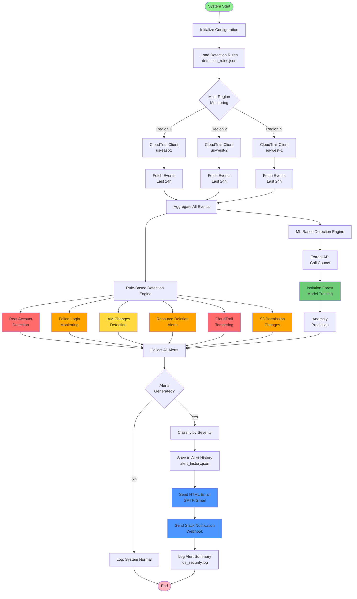

# Cloud Intrusion Detection System

## Description / Overview

A production-ready security monitoring solution that analyzes AWS CloudTrail logs to detect potential threats and anomalous behavior across your cloud infrastructure. The system combines machine learning algorithms with rule-based detection to identify security incidents in real-time, enabling rapid response to potential breaches.

Built for security teams managing multi-region AWS environments, this IDS provides comprehensive visibility into account activity, unauthorized access attempts, privilege escalations, and suspicious resource modifications. All alerts are logged for compliance and can be delivered via multiple channels including email and Slack.

## Features

**Security Detection Capabilities**
- Root account usage monitoring with critical alerts
- Brute force detection through failed login attempt tracking
- IAM policy and role modification monitoring
- Critical resource deletion alerts (EC2, RDS, Lambda, S3, DynamoDB)
- CloudTrail tampering detection to prevent logging bypass
- S3 bucket permission change monitoring
- Machine learning-based API anomaly detection using Isolation Forest

**Operational Features**
- Multi-region CloudTrail log aggregation and analysis
- Configurable detection rules via JSON configuration
- Multiple alert channels: HTML email and Slack webhooks
- Alert history logging for compliance and auditing
- Severity-based classification (Critical, High, Medium, Low)
- Structured logging with timestamps and context
- Customizable lookback periods and event limits

## Tech Stack

| Component | Technology | Purpose |
|-----------|-----------|---------|
| **Language** | Python 3.7+ | Core application logic |
| **AWS SDK** | Boto3 | CloudTrail log retrieval |
| **ML Framework** | scikit-learn | Anomaly detection (Isolation Forest) |
| **Data Processing** | NumPy | Numerical operations and array handling |
| **HTTP Client** | Requests | Slack webhook integration |
| **Email** | smtplib | Alert notifications via SMTP |
| **Configuration** | python-dotenv | Environment variable management |

## Architecture / System Design



**System Flow:**

1. **Initialization Phase** - Loads environment variables and detection rules from configuration files
2. **Data Collection Phase** - Connects to CloudTrail across all configured AWS regions and fetches recent events (configurable lookback period)
3. **Analysis Phase** 
   - Rule-based detections scan for known threat patterns
   - ML model analyzes API call frequencies for statistical anomalies
4. **Alert Processing Phase** - Consolidates findings, assigns severity levels, and logs to persistent storage
5. **Notification Phase** - Distributes alerts via configured channels (email, Slack) with formatted context

## Installation & Setup

**Prerequisites**
- Python 3.7 or higher
- AWS account with CloudTrail enabled
- IAM credentials with `cloudtrail:LookupEvents` permission
- Email account for notifications (Gmail recommended)

**Step 1: Clone Repository**
```bash
git clone https://github.com/suvadityaroy/Cloud-Intrusion-Detection-System.git
cd Cloud_Intrusion_Detection_System
```

**Step 2: Install Dependencies**
```bash
pip install -r requirements.txt
```

**Step 3: Configure Environment**
```bash
cp .env.example .env
```

Edit `.env` with your credentials:
```bash
AWS_ACCESS_KEY_ID=your_access_key
AWS_SECRET_ACCESS_KEY=your_secret_key
AWS_REGIONS=us-east-1,us-west-2
MAX_EVENTS=50
LOOKBACK_HOURS=24
SENDER_EMAIL=monitoring@company.com
EMAIL_PASSWORD=your_app_password
RECEIVER_EMAIL=security@company.com
SLACK_WEBHOOK_URL=https://hooks.slack.com/services/YOUR/WEBHOOK/URL
```

**Step 4: Customize Detection Rules (Optional)**
```bash
# Edit detection_rules.json to adjust thresholds
{
  "monitor_root_account": true,
  "failed_login_threshold": 5,
  "critical_resources": ["EC2", "RDS", "Lambda"]
}
```

**Step 5: Run the System**
```bash
python IDS_Cloudsecurity.py
```

**Step 6: Schedule Automated Monitoring**

*Linux/macOS (crontab):*
```bash
# Run hourly
0 * * * * cd /path/to/Cloud_Intrusion_Detection_System && python IDS_Cloudsecurity.py
```

*Windows (Task Scheduler):*
- Create new task
- Trigger: Daily, repeat every 1 hour
- Action: Start program `python.exe` with argument `IDS_Cloudsecurity.py`
- Start in: `C:\path\to\Cloud_Intrusion_Detection_System`

## Author / Contact

**Developer:** Suvaditya Roy

**Repository:** [github.com/suvadityaroy/Cloud-Intrusion-Detection-System](https://github.com/suvadityaroy/Cloud-Intrusion-Detection-System)

